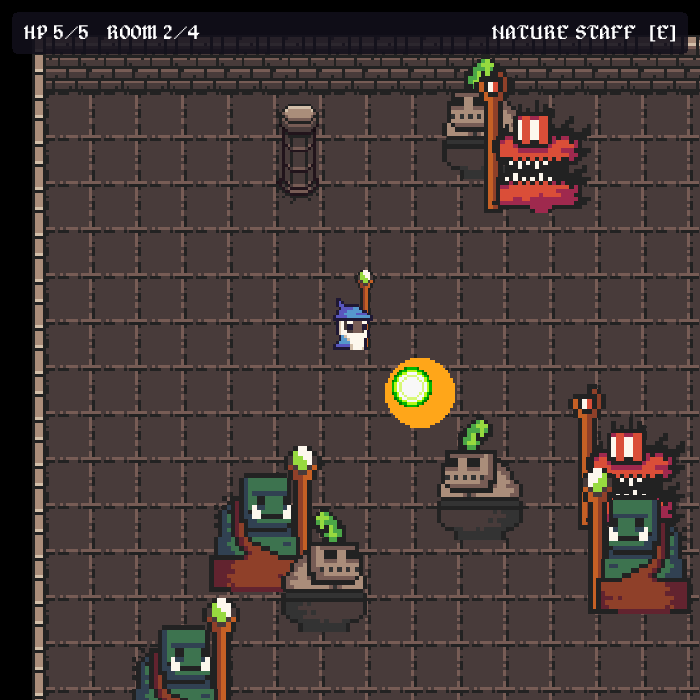
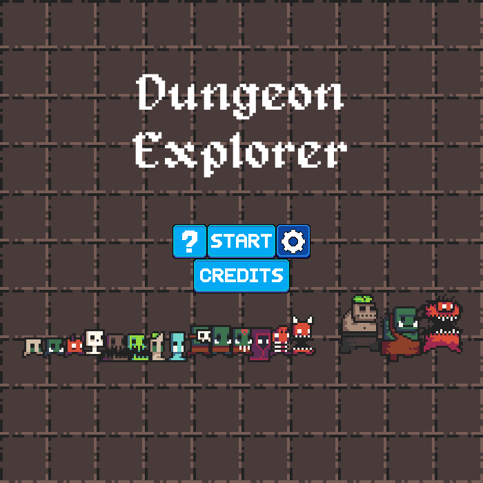
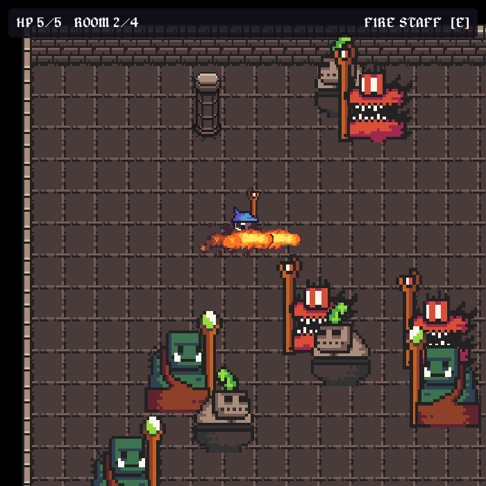

# Dungeon Explorer

**A pixel-art dungeon shooter built with Processing, Java, and Box2D.**

Cast fire, dodge projectiles, and swap to a nature staff while exploring tiled rooms full of demons, ogres, and zombies. A personal game project by **Winston Liu**, originally developed in 2018–2019.

[Project website](https://l-winston.github.io/DungeonExplorer/) · [Run locally](#run-locally) · [Controls](#controls) · [Inside the code](#inside-the-code)

<p align="center">
  
</p>

## A small dungeon, a lot going on

- **Two magic staffs:** animated fire projectiles and green nature orbs, with impact effects.
- **Three enemy types:** pursuing demons and ogres that cast spells, plus faster zombies.
- **Four rooms:** two generated arenas and two tile maps loaded from text files.
- **Physics and depth:** separate movement bodies and damage sensors, wall collisions, and sprites layered around the environment.
- **A complete menu shell:** an animated character parade, help, audio options, credits, and pause/resume.
- **Health and retry:** visible player HP and a restart prompt after defeat.

| The character parade | Fire in the dungeon |
| :---: | :---: |
|  |  |

*These are unedited frames captured from the running desktop game. Earlier development recordings are in [demos/](https://github.com/l-winston/DungeonExplorer/tree/master/demos).*

## Run locally

The game runs as a **desktop Processing sketch**. The website presents the project; it does not run the game in your browser.

1. Install [Processing](https://processing.org/download) and select **Java mode**. Tested with **Processing 4.3** and **4.5.6** on Apple silicon macOS; the standalone macOS export was tested with **4.3**.
2. Install these libraries through Processing's library manager, or use their official downloads:

   | Library | Tested version | Purpose |
   | --- | --- | --- |
   | [ControlP5](https://github.com/sojamo/controlp5/releases/tag/v2.2.6) | 2.2.6 | Buttons and menus |
   | [Box2D for Processing](https://github.com/shiffman/Box2D-for-Processing) | 0.4 | JBox2D physics |
   | [Minim](https://github.com/ddf/Minim) | 2.2.2 | Music playback |

   For manual installation, put each library folder inside your Processing sketchbook's `libraries` folder, then restart Processing. The folders should be named `controlP5`, `box2d_processing`, and `minim`, each containing its own `library` directory.

3. Clone the project:

   ```sh
   git clone https://github.com/l-winston/DungeonExplorer.git
   ```

4. Open `DungeonExplorer/DungeonExplorer.pde` and click **Run**, then **Start** in the game. Keep all the `.pde` tabs and the `data` folder together. If using GitHub's ZIP download, rename the extracted folder to `DungeonExplorer` first.

To make a desktop app, use **File → Export Application** in Processing 4.3. Both map files live in `data/` so they are included in the export.

## Controls

| Input | Action |
| --- | --- |
| **W A S D** | Move |
| **Mouse click** | Cast toward the cursor |
| **E** | Switch between fire and nature staffs |
| **Space** | Cycle through the four rooms |
| **Esc** | Pause / resume |
| **R** after defeat | Start a new run |
| **B** | Toggle collision debug outlines |
| **P** | Save a frame to `screenshots/capture-####.png` in the sketch folder |

Use the gear on the title screen to toggle music.

## Inside the code

The sketch is split into Processing tabs around the game's main systems:

| Files | Responsibility |
| --- | --- |
| `DungeonExplorer.pde` | Game phases, camera, menus, input, health display, and room transitions |
| `Entity.pde`, `Player.pde`, `Enemy.pde` | Physics bodies, player movement, enemy behavior, and damage |
| `Items.pde`, `Bullet.pde`, `Collisions.pde` | Staff types, projectile animation, and contact handling |
| `Room.pde`, `Wall.pde`, `Column.pde`, `Boundary.pde` | Tile maps, draw ordering, and level geometry |
| `ImageLoader.pde`, `Images.pde`, `Sound.pde`, `Font.pde` | Sprites, effects, music, and typography |
| `data/world1.txt`, `data/world2.txt` | Authored room layouts |

Physics bodies are created and destroyed between simulation steps. Room transitions finish pending changes in the old room before rebuilding the next room's bodies.

### Development checks

The macOS helper below builds the actual sketch and runs regression checks against its assets and Box2D world. It requires Python 3, Processing, and the libraries above; a game window opens during the run.

```sh
python3 tools/check_game.py --processing /Applications/Processing.app
```

To reproduce the README screenshots from a seeded playthrough:

```sh
python3 tools/check_game.py --processing /Applications/Processing.app --capture
```

Pass `--libraries /path/to/sketchbook/libraries` if your sketchbook is elsewhere. Screenshot capture overwrites the three named README images. Use Processing 4.3 to reproduce the checked-in captures.

## Project status

This is a playable **combat prototype**. Room changes use a debug-style shortcut, weapon damage is not balanced, and there is no save system or campaign progression. The current maintenance pass fixes zero-HP enemy deaths, player damage and defeat, stuck movement after pausing, room-transition cleanup, and exported map loading.

The [existing GitHub Pages site](https://l-winston.github.io/DungeonExplorer/) publishes this README from the repository's `master` branch using the Cayman theme.

## Credits

Game programming and project development: **Winston Liu**.

Built with Processing, ControlP5, Daniel Shiffman's Box2D for Processing, and Minim. The bundled Pixel FX effects include a [public-domain notice](https://github.com/l-winston/DungeonExplorer/blob/master/data/game/pixel_effects/README.txt) crediting Davit Masia and CodeManu. Art, fonts, and audio remain bundled with the original project; that effects notice does not establish a license for the other assets.
